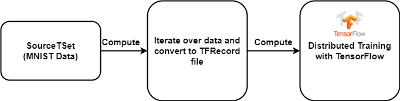
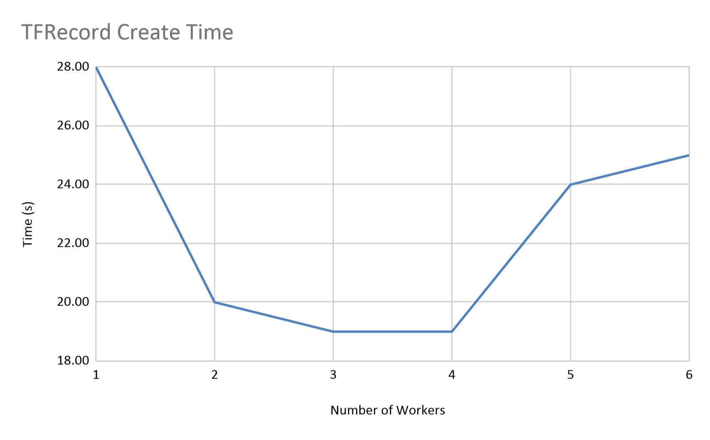
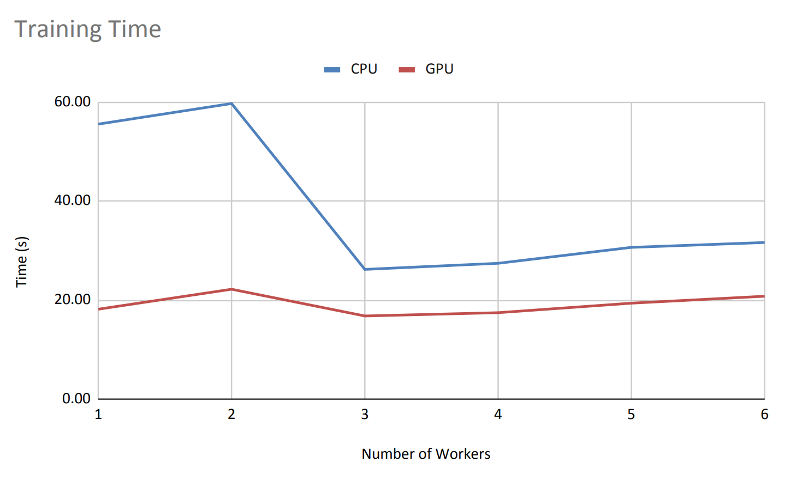
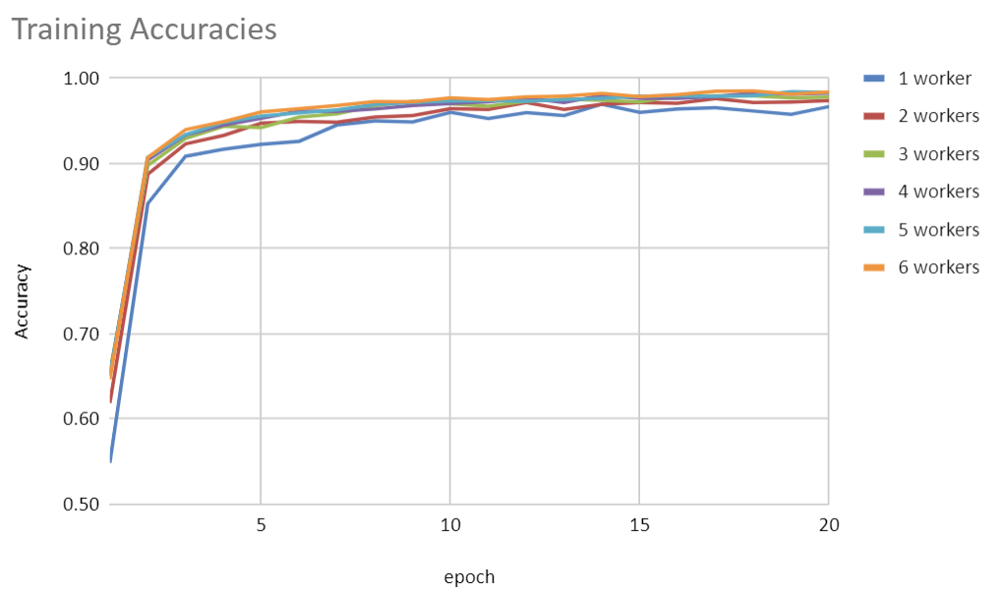

# TensorFlow on Twister2 :hand: fa18-523-68

| Selahattin Akkas
| sakkas@iu.edu
| Indiana University
| hid: fa18-523-68
| github: [:cloud:](https://github.com/cloudmesh-community/fa18-523-68/blob/master/project-report/report.md)
| code: [:cloud:](https://github.com/cloudmesh-community/fa18-523-68/blob/master/project-code)

---

Keywords: Twister2, Twister2 Deep Learning, Twister2 Keras, Twister2 MNIST

---

## Introduction

Twister2 [@fa18-523-68-twister2] is a big data toolkit that supports both 
streaming and batch data processing and can be used in data analytics tasks. 
It is designed to process large volumes of data. On the other hand, deep 
learning frameworks require preprocessed data, and it is quite challenging 
for large volumes of data without a big data toolkit. The goal of this project 
is to show how to preprocess data on Twister2, and  run a Distributed 
TensorFlow training on Twister2.

We follow a similar approach to TensorFlowonSpark [@fa18-523-68-www-tf-on-spark].  
In the *InputMode.SPARK*, TensorFlowonSpark distributes data between workers 
as csv files. In Twister2, we do the same except for the data format. We 
distribute data as TFRecord [@fa18-523-68-www-tfrecord] file, which is the 
TensorFlow's  binary file format that stores records.

Twister2 has TSet Data API [@fa18-523-68-tset], which provides functional-style 
programming. It is used to apply transformations on data [fa18-523-68-www-tset]. 
We build our application using TSet  python API.

## Requirements

The requirements of the project;

1. Twister2 version 0.6.0

   For Twister2 installation, the steps here can be followed: https://twister2.org/docs/compiling/compile_overview

2. Python 3.7.3 or higher

3. TensorFlow Gpu 2.1

   ```bash
   pip install tensorflow-gpu==2.1
   ```

4. twister2-python

   ```bash
   pip install twister2
   ```

5. jep 3.9.3 or higher

   ```
   pip install jep
   ```

   After the jep installation, the jep location should be added to *LD_LIBRARY_PATH* system variable:

   ```bash
   export LD_LIBRARY_PATH=$LD_LIBRARY_PATH:<jep-path>
   ```


## Dataset

As a dataset, we use MNIST[@fa18-523-68-lecun1998mnist] handwritten image 
dataset. The dataset has two parts; there are 60000 handwritten digits in the 
training set and 10000 handwritten digits in the test set.


## Architecture

- TSet starts with a source function. The source function reads data and has 
a next function that returns values one by one. The MNIST data is downloaded 
in the Source object.
- TSet's *compute* function takes a python function as a parameter and 
applies transformations on the data. The data can be accessed thanks to the 
iterator in the python function. In the first compute operation, the data is 
converted to TFRecord format and saved to the disk.
- We apply the last transformation, which is the training, using the *compute* 
function. However, we do not use the iterator in the last transformation; 
instead we use the TFRecord files that are saved to the disk.


The figure +@fig:architecture shows the architecture of the application.

{#fig:architecture}


## Implementation

The first part of the implementation is imports and arguments.  We need to 
import *TSetContext*,*Twister2Environment*, and *SourceFunction*. As 
arguments, we set the number of workers, the number of CPU cores per worker, 
the memory per worker and a parameter to use GPU in training or not. 

```python
import numpy as np

from twister2.TSetContext import TSetContext
from twister2.Twister2Environment import Twister2Environment
from twister2.tset.fn.SourceFunc import SourceFunc
import argparse
import time

parser = argparse.ArgumentParser(description='Twister2 Distributed MNIST Argument Parser')
parser.add_argument('--numberOfWorkers', required=True, help='number of workers')
parser.add_argument('--cpu', required=True, help='number of CPU per worker')
parser.add_argument('--ram', required=True, help='memory per worker')
parser.add_argument('--useGPU', required=True, help='train on GPU')

args = parser.parse_args()
```

After getting the parameters, we need to set *Twister2Environment*, which is 
the entry point of the application.

```python
env = Twister2Environment(resources=[{"cpu": int(args.cpu), "ram": int(args.ram), "instances": int(args.numberOfWorkers)}])
```


### TSet Source Function

The source function downloads the MNIST data. When it is called, the *next* 
function sends data one by one.  The source function will be created on each 
worker. If we want each worker to work on different data or a different part 
of the data, it should be handled in the *Source* class.  In our application, 
we divide equally between workers so that each worker will get a different 
part of the data.

```python
# TSet Source Function
# TSet is similar to Spark's RDD
class MNISTTrainingSource(SourceFunc):

    def __init__(self, num_worker,worker_id):
        super(MNISTTrainingSource, self).__init__()
        import os
        import math
        # to run this operation on CPU
        os.environ['CUDA_VISIBLE_DEVICES']=''
        import tensorflow as tf
        
        self.index = -1
        start_time = time.time()
        data_url = 'https://storage.googleapis.com/tensorflow/tf-keras-datasets/mnist.npz'
        data_path = tf.keras.utils.get_file('mnist.npz', data_url)        

        with np.load(data_path) as data:
            record_per_worker = math.ceil(len(data['x_train']) / num_worker)
            self.train_x = data['x_train'][worker_id * record_per_worker: (worker_id + 1) * record_per_worker]
            self.train_y = data['y_train'][worker_id * record_per_worker: (worker_id + 1) * record_per_worker]
            
    def has_next(self):
        return self.index < self.train_x.shape[0] - 1

    def next(self):
        self.index += 1
        return [self.train_x[self.index], self.train_y[self.index]]

```


### Converting Data to TFRecord Format


After the source is created,  TSet's *compute* function is executed. This 
function gets a python function as a parameter.

```python
data = env.create_source(MNISTTrainingSource(numberOfWorkers, worker_id), 
    numberOfWorkers).cache()
compute = data.compute(toTFRRecord)
compute.for_each(lambda x: print(x))

```

*toTFRecord* function is provided to compute function as a parameter. This 
function gets an iterator as a parameter and all the data can be accessed 
using the iterator. Inside the function, the data is read and converted to 
TFRecord format.

```python
# A mapping function to convert data to TensorFlow's binary data format
def toTFRRecord(itr, collector, ctx:TSetContext):
    import os
    
    # to run this operation on CPU
    os.environ['CUDA_VISIBLE_DEVICES']=''
    import tensorflow as tf

    def _int64_feature(value):
        return tf.train.Feature(int64_list=tf.train.Int64List(value=[value]))

    def _float_feature(value):
        return tf.train.Feature(float_list=tf.train.FloatList(value=[value]))

    def _bytes_feature(value):
        return tf.train.Feature(bytes_list=tf.train.BytesList(value=[value]))
    def serialize_example(feature0, feature1):
        feature = {
            'image': _bytes_feature(feature0),
            'label': _int64_feature(feature1)
        }
        example_proto = tf.train.Example(features=tf.train.Features(feature=feature))
        return example_proto.SerializeToString()

    worker_id = ctx.worker_id

    file_name = '/path/mnist.tfrecord' + str(worker_id)
    with tf.io.TFRecordWriter(file_name) as writer:
        count = 0
        for record in itr:
            writer.write(serialize_example(record[0].tostring(), record[1]))
            count += 1
            if count % 1000 == 0:
                print('WORKER-' + str(worker_id) + ':', '',count , 'records has been saved')
    print('WORKER-' + str(worker_id) + ':', '',count , 'records has been saved in total')
    collector.collect(1)

```


### Distributed Training in Twister2

The last data transformation is the model training. *trainModel* python 
function contains the model and the distributed training settings.

We need to set *TF_CONFIG* system variable for the distributed training. It  
contains ip addresses and ports of the workers.

```python
# required system variable for Distributed TensorFlow
def setTFCONFIG():
    start_port = 8000
    cluster = {'worker': []}
    for i in range(num_workers):
        cluster['worker'].append('localhost:' + str(start_port + i))
        os.environ['TF_CONFIG'] = json.dumps({'cluster': cluster,
                                         'task': {'type': 'worker', 'index': worker_id}})
    
setTFCONFIG()
```

The following part is critical for the distributed training, and it should be 
set before creating the model.

```python
# Distribution Strategy
 strategy = tf.distribute.experimental.MultiWorkerMirroredStrategy()
```

 We also need to apply some data transformation in the TensorFlow data 
 pipeline. *scale* function scales pixel values between zero and one. The 
 decode function is required to read a TFRecord file.

```python
# Scaling mapping function
def scale(image, label):
    image = tf.cast(image, tf.float32)
    image /= 255
    return image, label

# decode data from tfrecord file
def decode(serialized_example):
    features = tf.io.parse_single_example(
         serialized_example,
         features={
            'image': tf.io.FixedLenFeature([], tf.string),
            'label': tf.io.FixedLenFeature([], tf.int64),
         })
    image = tf.io.decode_raw(features['image'], tf.uint8)
    label = tf.cast(features['label'], tf.int32)
    image.set_shape((28 * 28))
    image = tf.reshape(image, [28,28,1])
    return image, label
```

Normally, TensorFlow shards data between workers to make sure each worker 
gets different data. However, we give a different file to each worker. 
Therefore, we set  *AutoShardPolicy.OFF*.

```python
# We give a different file for each worker. Therefore, there is no need to shard data.
file_name = '/scratch/mnist.tfrecord' + str(worker_id)
options = tf.data.Options()
options.experimental_distribute.auto_shard_policy = tf.data.experimental.AutoShardPolicy.OFF
```

TensorFlow sets batch size based on number of workers: 
*batch_per_worker = batch/number_of_worker*. We need to multiply the batch 
size with the number of workers to make sure each worker gets 50 training 
samples for each iteration.

    # TensorFlow sets batch size based on number of workers. batch_per_worker = batch/number_of_worker
    batch_size = 50
    global_batch_size = batch_size * num_workers
The following part builds TensorFlow input pipeline:

```python
train_dataset = tf.data.TFRecordDataset(file_name)\
	.map(decode).map(scale).repeat().shuffle(1000).batch(global_batch_size)
```

Our deep learning model is defined below:

```
def cnn_model():
    model = tf.keras.Sequential()
    model.add(Conv2D(32, kernel_size=(3,3), activation='relu',input_shape=(28, 28, 1)))
    model.add(MaxPooling2D(pool_size=(2,2)))
    model.add(Conv2D(64, kernel_size=(3,3), activation='relu'))
    model.add(MaxPooling2D(pool_size=(2,2)))
    model.add(Conv2D(128, kernel_size=(3,3), activation='relu'))
    model.add(MaxPooling2D(pool_size=(2,2)))
    model.add(Flatten())
    model.add(Dense(64, activation='relu'))
    model.add(Dense(10, activation='softmax'))
    model.compile(
        loss=tf.keras.losses.sparse_categorical_crossentropy,
        optimizer=tf.keras.optimizers.Adam(learning_rate=0.001, amsgrad=True),
        metrics=['accuracy'])
    return model
```

To run the training in distributed mode, we need to build our model in the 
TensorFlow distribution strategy block:

```python
with strategy.scope():
    multi_worker_model = cnn_model()
```

Finally, running the following line will start the training:

```python
multi_history = multi_worker_model.fit(x=train_dataset, epochs=20, steps_per_epoch=50, verbose=verbose)
```


## Benchmark

We provide TFRecord file creating times, training accuracy, and the training 
time for the benchmark. We run our application on one of FutureSystems' 
[@fa18-523-68-www-futuresystems] Romeo node. The node has 2x12-core Intel(R) 
Xeon(R) E5-2670 v3 (Haswell) processors with 128 GB main memory and 4 Tesla 
K80 GPU cards, which each of which has dual GPU unit. The node runs on Red 
Hat Enterprise Linux Server 7.7 (Maipo).
We provide a benchmark from 1 worker to 6 workers. We set the number of CPU 
cores per worker to 4, memory to 8096 MBs. 


### TFRecord Creating Time

We have 60000 training images, and we split data between workers. Therefore, 
when we increase the number of workers, each worker will process fewer data. 
Figure +@fig:tfrecordTime shows the times for different number of workers . 
The time decreases up to 4 workers; however, it increases after four workers 
due to initialization requires more time.

{#fig:tfrecordTime}

### Training Time

We run training with and without GPU. Figure +@fig:trainingTime shows the 
training times. In the GPU case, the training time does not change much. 
While CPU handles data reading data from the TFRecord file and prepares data 
for GPU, GPU runs the training. On the other hand, CPU training times reduce 
sharply after two workers then increase slowly when we further increase the 
number of workers. Note that MNIST is quite small, and it does not require 
distributed training. For big models and big datasets, running distributed 
will help the training time much better. 


{#fig:trainingTime}


### Training Accuracy

Figure +@fig:accuracy shows the training times. The training accuracies are 
very close to each other. Hence, we are able to reduce the training time by 
distributing the training without accuracy loss.

{#fig:accuracy}

## Conclusion

Deep learning frameworks are not good at data preprocessing, and it is 
impractical to preprocess a large amount of data without a big data toolkit. 
Twister2 provides good performance for data analytics tasks and can be used 
for both batch and stream processing. We show how to run TensorFlow on 
Twister2. MNIST example is quite simple, and doesn't utilize capabilities of 
the Twister2 completely. Nevertheless, it shows that Twister2 can be used for 
Deep Learning tasks.

For future work, Twister2 TensorFlow integration can be improved and provide 
APIs to users for TensorFlow tasks.

## Acknowledgement

We would like to thank Professor Dr. Geoffrey C. Fox, Dr. Gregor von 
Laszewski, for providing resources and opportunities. We would also like to 
express our appreciation to the FutureSystems team for their technical support.